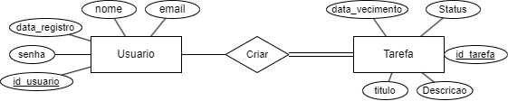

# Considerações iniciais

> Esse projeto tem como objetivo, pôr em prática o aprendizado adquirido na disciplina Engenharia de Software bem como praticar todo o processo de um desenvolvimento, já existe “Ns” aplicações todolist, mas meu objetivo não é querer criar algo novo, mas sim criar algo. No processo de desenvolvimento estou utilizando o ChatGPT para poder me direcionar e otimizar tempo de processo, como o ToDoList já é uma aplicação muito conhecida, não há a necessidade de reinventar a roda, então, estou coletando requisitos e sugestões de funcionalidades atraves do chatbot.

### Levantamento de requisitos:

>Atores:
Usuário Registrado:
os usuários que se cadastraram no aplicativo e têm acesso às funcionalidades completas.
Visitante não Autenticado:
Os usuários que estão visitando o aplicativo, mas ainda não fizeram login. Eles podem ter acesso a funcionalidades limitadas, como a página de login ou a página de registro.

* 1. Cadastro de Usuário
   Descrição: Permitir que os usuários se cadastrem e acessem o aplicativo com um nome de usuário e senha.
   Funcionalidade Futura: Recuperação de senha por e-mail.
   Prioridade: Alta
* 2. Adição de Tarefas
   Descrição: Permitir que os usuários adicionem novas tarefas à lista.
   Funcionalidade Futura: Adição de etiquetas ou categorias para organizar tarefas.
   Prioridade: Alta
* 3. Edição de Tarefas
   Descrição: Permitir que os usuários editem o título ou a descrição de uma tarefa existente.
   Funcionalidade Futura: Histórico de edições de tarefas.
   Prioridade: Média
* 4. Exclusão de Tarefas
   Descrição: Permitir que os usuários excluam tarefas da lista.
   Funcionalidade Futura: Arquivamento de tarefas em vez de exclusão definitiva.
   Prioridade: Alta
* 5. Marcação de Tarefas como Concluídas
   Descrição: Permitir que os usuários marquem tarefas como concluídas.
   Funcionalidade Futura: Visualização separada de tarefas concluídas e não concluídas.
   Prioridade: Alta
* 6. Ordenação de Tarefas
   Descrição: Permitir que os usuários ordenem as tarefas na lista.
   Funcionalidade Futura: Ordenação automática por data de vencimento ou prioridade.
   Prioridade: Média
* 7. Data de Vencimento
   Descrição: Permitir que os usuários definam uma data de vencimento para uma tarefa.
   Funcionalidade Futura: Notificações de lembrete de tarefas próximas da data de vencimento.
   Prioridade: Média
* 8. Busca e Filtro de Tarefas
   Descrição: Permitir que os usuários busquem tarefas específicas e filtrem por diferentes critérios.
   Funcionalidade Futura: Filtros avançados com base em várias características.
   Prioridade: Média
* 9. Interface Responsiva
   Descrição: Garantir que o aplicativo seja acessível em diferentes dispositivos (desktop, tablet, mobile).
   Funcionalidade Futura: Funcionalidades específicas otimizadas para diferentes plataformas.
   Prioridade: Alta
* 10. Feedback de Ação
    Descrição: Fornecer feedback imediato após a execução de uma ação (por exemplo, adição, edição ou exclusão de uma tarefa).
    Funcionalidade Futura: Opções de personalização de feedback.
    Prioridade: Baixa
* 11. Autenticação
    Descrição: Garantir que apenas usuários autenticados tenham acesso às funcionalidades do aplicativo.
    Funcionalidade Futura: Integração com autenticação de terceiros (por exemplo, Google, Facebook).
    Prioridade: Média

### Descrição de casos de uso:

> * Caso de Uso 1: Cadastro de Usuário
Ator Principal: Visitante não Autenticado
Descrição: O visitante não autenticado deseja criar uma conta no aplicativo.
Fluxo Básico:
O visitante acessa a página de registro.
O sistema exibe um formulário de registro.
O visitante preenche os campos de nome de usuário e senha.
O visitante confirma o registro.
O sistema valida os dados e cria uma conta para o usuário.
O sistema redireciona o usuário para a página principal logado.

> * Caso de Uso 2: Adição de Tarefas
Ator Principal: Usuário Registrado
Descrição: O usuário deseja adicionar uma nova tarefa à sua lista.
Fluxo Básico:
O usuário está na página principal.
O usuário clica no botão "Adicionar Tarefa".
O sistema exibe um formulário para adicionar uma nova tarefa.
O usuário preenche os detalhes da nova tarefa (título, descrição, data de vencimento, etc.).
O usuário confirma a adição.
O sistema adiciona a tarefa à lista do usuário.

> * Caso de Uso 3: Edição de Tarefas
Ator Principal: Usuário Registrado
Descrição: O usuário deseja editar os detalhes de uma tarefa existente.
Fluxo Básico:
O usuário está na página principal.
O usuário clica na tarefa que deseja editar.
O sistema exibe os detalhes da tarefa e um botão "Editar".
O usuário clica no botão "Editar".
O sistema permite que o usuário edite os detalhes da tarefa (título, descrição, data de vencimento, etc.).
O usuário confirma a edição.
O sistema atualiza os detalhes da tarefa.

> * Caso de Uso 4: Exclusão de Tarefas
Ator Principal: Usuário Registrado
Descrição: O usuário deseja excluir uma tarefa de sua lista.
Fluxo Básico:
O usuário está na página principal.
O usuário clica na tarefa que deseja excluir.
O sistema exibe os detalhes da tarefa e um botão "Excluir".
O usuário confirma a exclusão.
O sistema remove a tarefa da lista do usuário.

> * Caso de Uso 5: Marcação de Tarefas como Concluídas
Ator Principal: Usuário Registrado
Descrição: O usuário deseja marcar uma tarefa como concluída.
Fluxo Básico:
O usuário está na página principal.
O usuário clica na tarefa que deseja marcar como concluída.
O sistema atualiza o status da tarefa para "concluída".

> * Caso de Uso 6: Ordenação de Tarefas
Ator Principal: Usuário Registrado
Descrição: O usuário deseja reordenar as tarefas em sua lista.
Fluxo Básico:
O usuário está na página principal.
O usuário arrasta e solta as tarefas na ordem desejada.
O sistema atualiza a ordem das tarefas na lista.

> * Caso de Uso 7: Data de Vencimento
Ator Principal: Usuário Registrado
Descrição: O usuário deseja definir uma data de vencimento para uma tarefa.
Fluxo Básico:
O usuário está adicionando ou editando uma tarefa.
O usuário seleciona ou insere uma data de vencimento para a tarefa.
O sistema registra a data de vencimento da tarefa.

> * Caso de Uso 8: Busca e Filtro de Tarefas
Ator Principal: Usuário Registrado
Descrição: O usuário deseja buscar ou filtrar tarefas com base em critérios específicos.
Fluxo Básico:
O usuário utiliza a função de busca ou filtros na página principal.
O sistema exibe os resultados de acordo com os critérios fornecidos.

> * Caso de Uso 9: Interface Responsiva
Ator Principal: Todos os Usuários
Descrição: Os usuários desejam acessar o aplicativo em diferentes dispositivos (desktop, tablet, mobile).
Fluxo Básico:
O usuário acessa o aplicativo a partir do dispositivo de escolha.
O sistema adapta a interface para proporcionar uma experiência otimizada no dispositivo em uso.

> * Caso de Uso 10: Feedback de Ação
Ator Principal: Usuário Registrado
Descrição: O usuário deseja receber feedback imediato após a execução de uma ação.
Fluxo Básico:
O usuário realiza uma ação, como adicionar, editar ou excluir uma tarefa.
O sistema fornece feedback visual ou mensagens de confirmação.

> * Caso de Uso 11: Autenticação
Ator Principal: Visitante não Autenticado
Descrição: O visitante deseja autenticar-se no aplicativo para acessar funcionalidades exclusivas.
Fluxo Básico:
O visitante acessa a página de login.
O sistema exibe um formulário de login.
O visitante insere seu nome de usuário e senha.
O visitante confirma o login.
O sistema valida as credenciais e redireciona o usuário para a página principal logado.

### Diagrama de casos de uso:

> Foi utilizado o Draw.io para elaborar o diagrama em questão.

### Diagrama ER Banco de dados:

> Foi utilizado o Draw.io para elaborar o diagrama em questão.

### Recursos e tecnologias:
> Como o intuito e objetivo desse projeto é pôr em prática o conteúdo aprendido na disciplina Engenharia de Software, e pôr em prática conhecimentos, decidi subdividir o projeto em algumas tecnologias, por conta de familiaridade e conhecimento com Java, o Spring / Spring Web vai ser responsável por toda a parte de backend atraves da API Rest bem estruturada que a framework fornece, quanto ao frontend ainda nao decidi exatamente qual framework utilizar, mas a priori utilizarei Flutter para o mobile e React para o Web, porem ao decorrer do projeto pode haver mudanças.

